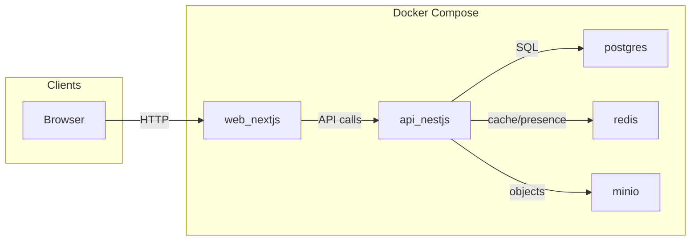

# Architecture

## Tech stack

| Layer | Technology |
|-------|------------|
| **Frontend** | Next.js 14+ (App Router), TypeScript, Tailwind CSS, shadcn/ui (or Radix-based components) |
| **Backend** | Node.js with NestJS (TypeScript), Prisma |
| **Database** | PostgreSQL (profiles, users, subscriptions, messages) |
| **Cache / sessions** | Redis (sessions, cache, chat presence) |
| **Auth** | JWT (access + refresh), bcrypt/argon2 for passwords |
| **Chat** | Socket.io or WebSocket; messages in PostgreSQL |
| **File storage** | S3-compatible (MinIO in Docker or AWS S3) |
| **Deployment** | Docker + Docker Compose |

## Repo layout (monorepo)

- **`apps/web`** – Next.js frontend
- **`apps/api`** – NestJS backend API
- **`packages/shared`** – Shared types, constants, validation schemas (e.g. Zod)

## High-level architecture

The application runs as multiple services. In development you can run the API and web app locally with external PostgreSQL and Redis; in production everything is orchestrated with Docker Compose.

- **web**: Next.js app; serves UI and calls the API (e.g. `NEXT_PUBLIC_API_URL`).
- **api**: NestJS app; REST + WebSocket; uses PostgreSQL (Prisma), Redis, and MinIO (S3-compatible) for profile photos.
- **postgres**: PostgreSQL 16; persistent data (users, profiles, messages, subscriptions, etc.).
- **redis**: Redis 7; sessions, cache, optional chat presence/rate limits.
- **minio**: S3-compatible object store; profile photo uploads.

Reference: [docker-compose.yml](../docker-compose.yml) in the repo root.

## Conventions

- TypeScript strict mode; avoid `any` and unsafe casts.
- API: REST (and WebSocket for chat); Zod or class-validator for request validation.
- Errors: structured, actionable; consistent API error shape.
- Logging: use a logger (e.g. NestJS Logger, Pino); no `print`.
- Security: no secrets in code; env vars; parameterized queries; admin routes behind admin guard.

## FRD reference

Epic and stories live in the repo under `jira/` (see `jira/EPIC-MATRIMONY.md` and `jira/stories/*.md`). Use them when implementing or reviewing so behaviour matches the FRD.

---

**Jira**: Optionally add a **Jira Issues** widget filtered by component or label (e.g. `architecture`, `devops`) if you use those in Jira.
