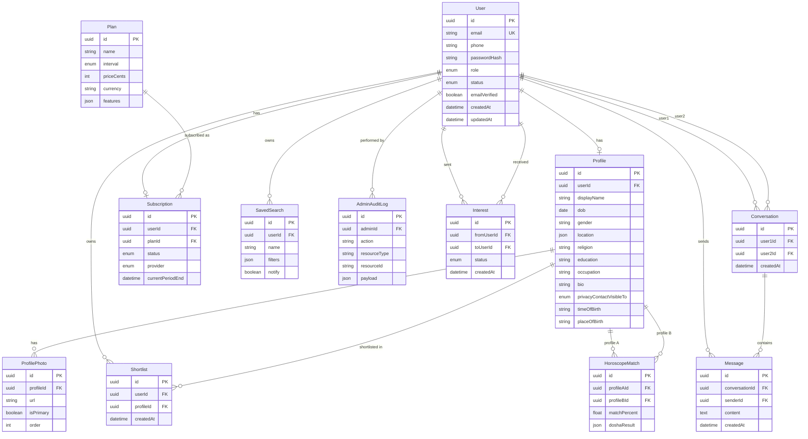

# Database schema overview

PostgreSQL schema for the matrimony platform, defined in [apps/api/prisma/schema.prisma](../apps/api/prisma/schema.prisma).

## Entity relationship diagram

## Tables and purpose

| Table | Purpose |
|-------|--------|
| **users** | Accounts: email, password hash, role (user/admin), status (pending/approved/rejected). One profile per user. |
| **profiles** | Matrimonial profile: display name, DOB, gender, location (JSON), education, occupation, bio, horoscope fields (time/place of birth), contact visibility. |
| **profile_photos** | Photos for a profile; one can be marked primary. |
| **shortlists** | User saves a profile to their shortlist. Unique per (userId, profileId). |
| **interests** | One user sends interest to another; status: pending, accepted, declined. Unique per (fromUserId, toUserId). Chat is allowed only when both directions are accepted (mutual interest). |
| **saved_searches** | User saves search filters (JSON) with a name and optional notify flag. |
| **horoscope_matches** | Precomputed horoscope match between two profiles: match percentage and dosha result (JSON). Unique per (profileAId, profileBId). |
| **conversations** | One row per pair of users who can chat (after mutual interest). user1Id and user2Id are normalized so user1Id &lt; user2Id. |
| **messages** | Chat messages: conversation, sender, content, timestamp. |
| **plans** | Subscription plans (e.g. monthly/yearly), price, currency, features (JSON). |
| **subscriptions** | User’s current subscription: plan, status, provider (e.g. Stripe), period end. One active subscription per user. |
| **admin_audit_logs** | Admin actions: who did what, on which resource, with optional payload. |

## Enums

- **UserRole:** `user`, `admin`
- **UserStatus:** `pending`, `approved`, `rejected`
- **ContactVisibility:** `all`, `premium`, `none` (who can see profile contact)
- **InterestStatus:** `pending`, `accepted`, `declined`
- **PlanInterval:** `month`, `year`
- **SubscriptionStatus:** `active`, `trialing`, `past_due`, `canceled`, `incomplete`, `incomplete_expired`, `unpaid`
- **SubscriptionProvider:** `stripe`, `mock`

## Important relationships

1. **User ↔ Profile** – One-to-one. Every app user has at most one profile (for the matrimony flow).
2. **Shortlist** – Many-to-many between User and Profile: a user can shortlist many profiles; a profile can be shortlisted by many users.
3. **Interest** – Directed: User A sends interest to User B. Mutual interest = two rows (A→B and B→A) both accepted.
4. **Conversation** – One row per pair (user1Id, user2Id) with user1Id &lt; user2Id. Created when both users have mutual interest; messages reference this conversation.
5. **Subscription** – User has at most one subscription; it references a Plan and stores provider and period.

## Indexes

Indexes are defined in the Prisma schema for:

- **profiles:** gender, dob, education, occupation, religion (for search)
- **shortlists:** userId
- **interests:** fromUserId, toUserId
- **saved_searches:** userId
- **horoscope_matches:** profileAId, profileBId
- **conversations:** user1Id, user2Id
- **messages:** conversationId, senderId, createdAt
- **admin_audit_logs:** adminId, resourceType, createdAt

Unique constraints enforce: one profile per user; one shortlist entry per (user, profile); one interest per (from, to); one conversation per (user1, user2); one subscription per user.
